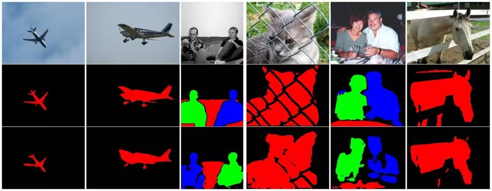

# README
## 简介
对MobileInst: Video Instance Segmentation on the Mobile论文中提出实例分割方法进行复现。本论文为视频实例分割任务，由于在VOC数据集上进行训练和测试，只实现图像实例分割部分。模型主要分为两个部分，backbone部分采用TopFormer模型，分割部分由两部分组成：Semantic-enhanced Mask Decoder和Dual Transformer Instance Decoder。

通过运行sbin中的脚本，可以进行对应实验，进行训练和测试。

## 心路历程
在此之前没有接触过实例分割领域，所以对该领域的任务、重要工作和代码等方面不是很了解。在接受这个任务的最初几天，主要在进行相关领域的论文调研，在实例分割领域阅读了Mask-RCNN、Mask2Former、SparseInst等论文，了解了实例分割的基本任务和通过query实现实例的确定和分割的方法。本论文中使用TopFormer和SeaFormer作为backbone，而我对ViT的认识停留在基本的ViT和Swin Transformer，因此对相关论文进行了研读。在此之后又研究了CrossVIS等VIS论文，进行了阅读。

此后学习相关的代码实现，首先对TopFormer的代码进行了学习，了解了它的基本结构的实现方法，尤其是对于多头注意力机制的实现部分有了清晰的了解。在此基础上完成了MobileInst的backbone部分，同时学习TopFormer的代码实现MobileInst的模型部分。

实例分割的训练需要匹配、计算loss，我学习了Mask2Former、SparseInst的代码实现，然后实现了MobileInst的匹配和loss计算部分。在这个过程中，我理解了怎样用模型输出计算loss和多任务训练的loss计算，同时学会了一些之前不知道的pytorch的操作。

对于数据集的处理代码实现，我首先学习了COCO格式的数据集的处理方法（尤其是实例分割部分），包括处理COCO格式数据集和转成COCO格式的实现方法，在这个过程中也学到RLE编码等以前不了解的东西。

总的来说，这次任务中我从数据集、模型到训练和测试都自己用 pytorch 从头实现一遍，我学习到了很多。
## 结果

模型训练结果如下图所示：

训练的结果相比提供的文档低了一些，我认为主要有以下原因：
1. 训练轮次较少：由于我只能使用2080Ti单卡进行训练，单轮训练就需要较长时间，中间由于各种原因多次停止训练，训练14400轮难以实现，即便训练了一个星期也只训练了3000轮，还没有完全收敛；
2. 显存较小，单次batch数据量少仅为4个，训练过程不稳定；
3. 由于使用pytorch直接写代码而没有使用detectron2等库，数据集的默认采样器、lr scheduler等设置较为粗糙；
4. 阈值设置不好，很多实例甚至图片（尤其是小目标、多目标）没有产生mask，导致recall极低。

得到Val上部分结果如下图所示（第一行为原图，第二行为gt，第三行为预测）：

## 时间线
- 4.3-4.6 阅读相关论文
- 4.7-4.8 阅读相关代码
- 4.9-4.11 编写相关代码
- 4.12- 训练模型和测试
---
5.10更新

使用tiny Topformer模型作为backbone完成14400轮训练，训练集AP结果如下：

验证集AP结果如下：

---
5.**12更新**

发现原实现中的backbone部分有一些问题，同时对照SparseInst对模型细节做了一些修改，换用Detectron2实现。代码保存在./mobileinst-detectron2中。

测试集上结果很差，我用中间保存的模型参数进行测试AP均没有超过0.05。我clone了SparseInst在数据集上训练了144000个iter后结果与以上验证集结果差不多，所以怀疑是训练集数据量太少训不出能够足够拟合的模型。

SparseInst训练144000个iter后的验证集结果：

MobileInst（TopFormer_base作为backbone）训练144000个iter后的训练集结果：

---
6.28最终更新（之前因为服务器上不去所以没有上传最终结果直到今天才上传）

破案了，读取预训练参数有问题，下游任务（尤其是用Transformer）没有预训练参数是训不出结果的

最终的COCO测试集结果如下，与论文仅相差2个点左右：

